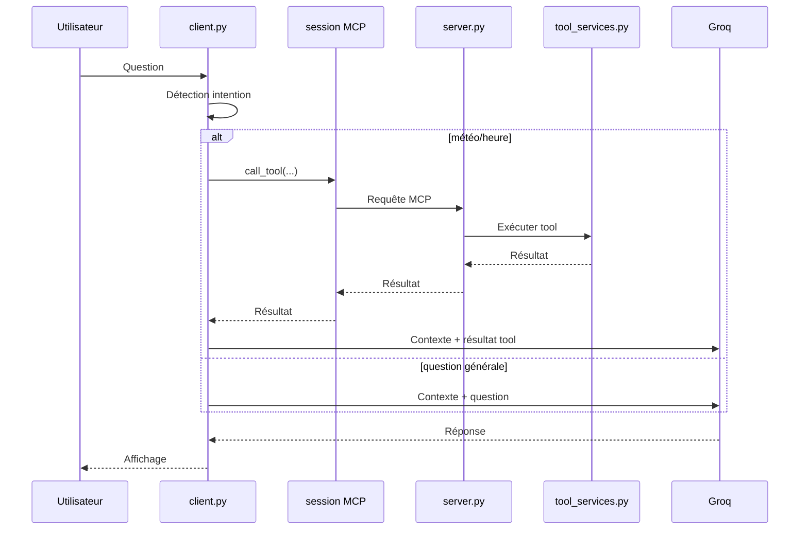

# MCP Simple Agent (Groq + wttr.in + pytz)

Assistant CLI Python avec 2 outils :

- `get_weather(city)` via `wttr.in`
- `get_time(timezone)` via `pytz`

Le projet contient :

- un client conversationnel (`client.py`)
- un serveur MCP (`server.py`) utilisé par le client

## Parcours de formation

Une documentation de formation complète est disponible dans `docs/formation` :

- [Parcours principal](docs/formation/README.md)

## Fonctionnalités

- Détection automatique des questions météo/heure
- Réponse normale pour les autres questions
- Historique de conversation en mémoire (session en cours)
- Mode debug activable via `.env`
- Météo avec source explicite (`wttr.in`)

## Architecture

```text
Utilisateur
  -> client.py
     -> session MCP locale
     -> server.py
     -> tool_services.py
     -> wttr.in (météo)
     -> pytz (heure)
      -> modèle via Groq (formulation finale)
```

### Schéma de séquence (résumé)



## Qu'est-ce que Groq ?

Groq est la plateforme d'inférence utilisée pour exécuter le modèle de langage et générer des réponses en langage naturel.

Points importants :

- Groq ne fournit pas les données météo.
- Groq héberge et sert le modèle de langage.
- Le modèle reformule et produit la réponse finale affichée.
- Les données météo proviennent de `wttr.in`.

En pratique :

- `wttr.in` = source de données météo
- `pytz` = calcul de l'heure locale
- Groq = couche d'inférence qui sert le modèle conversationnel

## Qui fait quoi dans le projet ?

- `client.py`
  - détecte l'intention utilisateur (météo, heure, autre)
  - s'appuie sur `intent_router.py` pour la détection d'intention
  - démarre une session MCP locale vers `server.py`
  - passe par `mcp_client.py` pour parler au serveur
  - appelle les tools via MCP si nécessaire
  - envoie le contexte et le résultat au modèle via Groq
  - affiche la réponse finale

- `server.py`
  - expose les tools `get_weather` et `get_time` via MCP
  - est utilisé par `client.py`
  - permet aussi d'intégrer ces tools dans un autre agent MCP

- `intent_router.py`
  - détecte si une question doit aller vers la météo ou l'heure

- `mcp_client.py`
  - ouvre la session MCP locale en `stdio`
  - appelle les tools côté serveur

- `tool_services.py`
  - contient la logique métier partagée des tools
  - évite de dupliquer la météo et l'heure entre client et serveur

- `wttr.in`
  - retourne des données météo JSON (`temp_C`, `humidity`, `windspeedKmph`, etc.)

- `pytz`
  - retourne l'heure selon un fuseau IANA (`Europe/Paris`, `Asia/Tokyo`, ...)

## Flux détaillé d'une question

### 1) Exemple météo

Question : "Quelle est la météo à Nantes ?"

Étapes :

1. Le client détecte un mot-clé météo.
2. Le client extrait la ville.
3. Le client appelle `server.py` via MCP.
4. `server.py` exécute le tool météo via `tool_services.py`.
5. Le résultat brut est ajouté à l'historique de conversation.
6. Le modèle via Groq produit une réponse naturelle et lisible.
7. La réponse est affichée.

### 2) Exemple heure

Question : "Quelle heure est-il à Tokyo ?"

Étapes :

1. Le client détecte une intention heure.
2. Le client choisit le fuseau (`Asia/Tokyo`).
3. Le client appelle `server.py` via MCP.
4. Le serveur calcule l'heure avec `pytz`.
5. Le résultat est passé au modèle via Groq pour la formulation finale.

### 3) Exemple question générale

Question : "Expliquer la relativité"

Étapes :

1. Aucun tool n'est appelé.
2. Le message est envoyé directement au modèle via Groq.
3. Le modèle répond normalement via Groq.

## Prérequis

- Python 3.10+
- Clé API Groq
- Connexion Internet

## Installation

```bash
python -m venv .venv

# PowerShell
.venv\Scripts\Activate.ps1

# Linux / macOS / Git Bash
source .venv/bin/activate

pip install -r requirements.txt
```

## Configuration

Créer `.env` à la racine :

```env
GROQ_API_KEY=gsk_...
DEBUG=false
VERIFY_SSL=true
REQUEST_TIMEOUT_SECONDS=10
```

La clé API ne doit jamais être commitée dans Git.
Elle doit rester uniquement dans `.env` (fichier local privé).

### DEBUG

- `DEBUG=false` : pas de logs techniques
- `DEBUG=true` : affichage des logs `[DEBUG ...]`

Valeurs acceptées pour activer : `1`, `true`, `yes`, `on`.

### VERIFY_SSL

- `VERIFY_SSL=true` : vérification TLS/SSL active (recommandé)
- `VERIFY_SSL=false` : vérification désactivée (diagnostic local uniquement)

### REQUEST_TIMEOUT_SECONDS

- Définit le timeout HTTP des appels météo
- Valeur conseillée : `10` à `20`

## Lancer le client

```bash
python client.py
```

Le client démarre automatiquement `server.py` en arrière-plan via une session MCP `stdio`.

### Comment le serveur MCP s'active

Le serveur MCP peut être activé de 2 façons :

1. mode automatique (flux principal)

- `python client.py` lance `server.py` comme sous-processus
- la connexion se fait en `stdio` via `mcp_client.py`
- c'est le mode recommandé pour l'usage normal

2. mode manuel (debug ou intégration externe)

- lancer `python server.py` directement
- le serveur reste en attente d'un client MCP sur stdin/stdout
- utile pour brancher un autre client MCP que `client.py`

Exemples de questions :

```text
Quelle est la météo à Nantes ?
Quelle est la température à Rezé ?
Quelle heure est-il à Tokyo ?
Expliquer la relativité
```

Quitter :

```text
exit
```

## Lancer le serveur MCP seul

```bash
python server.py
```

Le serveur expose 2 tools :

- `get_weather`
- `get_time`

Quand lancer ce serveur directement ?

- quand un client MCP externe doit consommer ces tools
- quand on veut valider une architecture client MCP -> serveur MCP
- quand on veut tester la déclaration et l'appel des tools au niveau protocole

Pourquoi ce serveur n'est plus optionnel dans ce projet :

- le flux principal CLI passe par `client.py` puis par une session MCP locale
- `client.py` dépend maintenant de `server.py` pour accéder aux tools
- `server.py` reste aussi réutilisable par d'autres clients MCP

Règle pratique :

- usage assistant local : lancer `python client.py`
- usage intégration MCP externe : lancer `python server.py` puis connecter un autre client MCP

## Vérifier localement le passage par MCP

Commande 1 : vérifier que le serveur expose bien les tools via la session MCP locale.

```bash
python - <<'PY'
import asyncio
from mcp_client import MCPToolClient

async def main():
  client = MCPToolClient()
  try:
    tools = await client.connect()
    print('tools:', sorted(tools))
  finally:
    await client.aclose()

asyncio.run(main())
PY
```

Commande 2 : vérifier un appel météo et un appel heure via MCP.

```bash
python - <<'PY'
import asyncio
from mcp_client import MCPToolClient

async def main():
  client = MCPToolClient()
  try:
    await client.connect()
    print(await client.call_tool('get_weather', {'city': 'Paris'}))
    print(await client.call_tool('get_time', {'timezone': 'Europe/Paris'}))
  finally:
    await client.aclose()

asyncio.run(main())
PY
```

Résultat attendu : présence de `get_weather` et `get_time`, puis retour texte météo/heure sans appeler directement les fonctions côté client.

## Limites actuelles

- seules les requêtes détectées comme météo/heure passent par MCP
- les questions générales ne déclenchent pas de tool et partent directement vers Groq
- la détection d'intention repose sur des mots-clés simples (pas encore de planification multi-tools)

## Comportement des tools

### get_weather

- Source : `wttr.in`
- Champs retournés : conditions, température, ressenti, vent, humidité
- En cas d'erreur réseau/API : message d'erreur clair
- Note : le ressenti dépend des champs fournis par la source

### get_time

- Source : `pytz`
- Attend un fuseau horaire IANA (`Europe/Paris`, `Asia/Tokyo`, ...)
- En cas de fuseau invalide : message d'erreur clair

## Structure du projet

```text
mcp-simple-agent/
├── client.py
├── intent_router.py
├── mcp_client.py
├── server.py
├── settings.py
├── tool_services.py
├── requirements.txt
├── .env
└── README.md
```

## Notes techniques

- Les appels HTTP utilisent `requests`.
- Les appels HTTP sont paramétrés via `.env` (`VERIFY_SSL`, `REQUEST_TIMEOUT_SECONDS`).
- La météo est volontairement simplifiée : une seule source (`wttr.in`) pour réduire la complexité.
- Le modèle Groq est configuré via `GROQ_MODEL` dans `settings.py`.

## Dépannage rapide

- `GROQ_API_KEY` manquante : vérifier `.env`
- Erreur de session MCP au démarrage : vérifier que `server.py` et les dépendances Python sont disponibles
- Erreur réseau météo : vérifier accès Internet/proxy/firewall
- Réponse trop lente : relancer, puis tester avec `DEBUG=true`
- Réponse météo vide/incomplète : tester l'URL `https://wttr.in/<ville>?format=j1` dans un navigateur
- `python server.py` arrêté au clavier : en mode MCP `stdio`, le serveur attend un client ; un arrêt manuel (`Ctrl+C`) est normal
