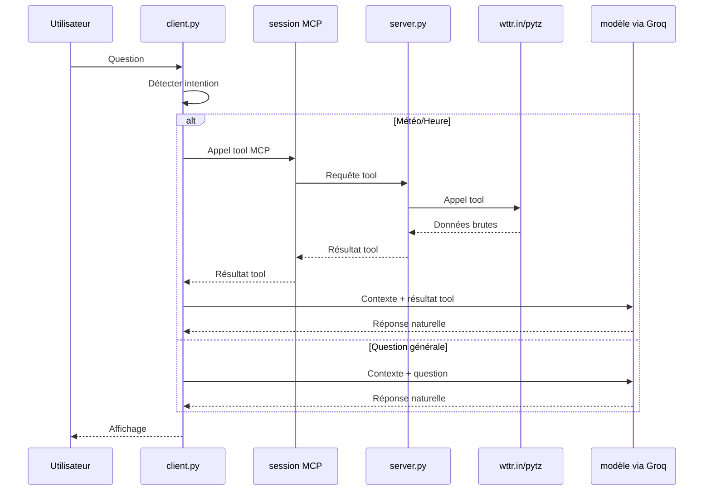

# 03 - Flux complet d'une requête

Le flux décrit ci-dessous correspond au mode principal actuel du projet : `client.py` démarre une session MCP locale, appelle `server.py` pour les tools et envoie ensuite le résultat au modèle servi via Groq.

## Vue rapide : flux principal

```text
Utilisateur -> client.py -> mcp_client.py -> server.py -> tool_services.py -> wttr.in/pytz -> modèle via Groq -> Réponse
```

## Cas A : question météo

Exemple : "Quelle est la météo à Nantes ?"

1. L'utilisateur écrit dans le terminal.
2. `detect_tool_request` détecte une intention météo.
3. `client.py` envoie un appel MCP à `server.py`.
4. `server.py` exécute `get_weather` via `tool_services.py`.
5. wttr.in renvoie les données météo.
6. Le résultat brut est transformé en texte technique.
7. Ce résultat est ajouté à l'historique.
8. Le contexte est envoyé au modèle via Groq.
9. Le modèle renvoie une réponse lisible.
10. Le terminal affiche la réponse.

## Cas B : question heure

Exemple : "Quelle heure est-il à Tokyo ?"

1. Détection de l'intention heure.
2. Choix du fuseau (exemple : Asia/Tokyo).
3. Appel MCP vers `server.py`.
4. Calcul via pytz dans `tool_services.py`.
5. Mise en forme finale par le modèle via Groq.

## Cas C : question générale

Exemple : "Expliquer la relativité"

1. Aucun tool n'est détecté.
2. La question part directement au LLM.
3. Réponse conversationnelle classique.

## Diagramme de séquence


